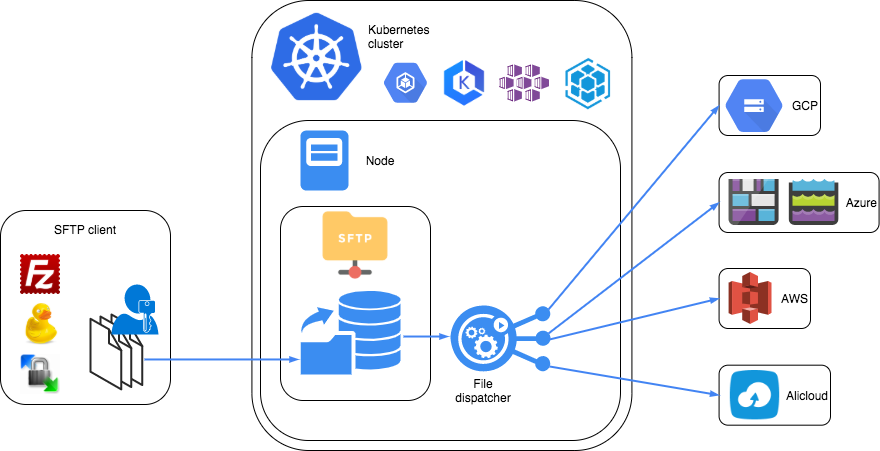

# nautilus-sftp-gateway


## Architecture




This is a Docker image containing a SSH server and an INotify daemon allowing to create a SFTP-to-GCS gateway server. Once deployed, you can connect to the SFTP server and read/write files that are immediately synchronised to GCS.

The repository contains the appropriate files to deploy the container to Kubernetes.

## Maintainer
- Cédric Magnan (@Cedric-Magnan or cedric.magnan@artefact.com)


## Overview

When you run a container based on this image, it creates an SFTP server that can only be accessed by one specified user, and moves uploaded data to one or more specified GCS buckets.

The user and the buckets are provided at runtime via container Environment variables. When the container starts, it uses the Environment variables to generate the appropriate configuration files and start the services. The container does not persist any data.

The container does not contain any credentials, they must be provided at deployment time via a mounted secrets volume on Kubernetes, or a mounted volume for vanilla Docker. See below for more information.


## Usage

### Installation

See [`Installing the dependancies`](./docs/Install.md)


### Configuration
All of the configuration is managed through the environment files stored in the `./env` directory. There is a `common` environment file that contains the majority of the configuration directives, and typically doesn't need to be changed. You can then create additional configuration files for different environments/clients, such as `dev` or `prod` for example.

The environment variables specified in the environment files override the values defined in the `common` file during processing.

These environment files are used to automatically generate various other configuration files (Helm `values.yaml` files, Kubernetes `configmap` files, etc.) – you shouldn't need to change anything other than the environment config files to configure any aspect of the system.

You can read the `common` and `sample` files in `./env` to understand what the configuration directives are for.

#### Credentials
In order for the service to run, you need to generate/provide various credential files:

- [GCP Service Account key file, to grant the image the right to upload files to a GCS bucket](./docs/GCS.md)
- [SSH Public key file, the public par of the public-private key used to connect to the SFTP server](./docs/SFTP.md)
- [SSH Host keys, the server's identity keys](./docs/SFTP.md)

#### Vanilla Docker
If you're using vanilla Docker, a directory containing the above secret files should be mounted onto the container to the path configured by `$APP_SECRETS_DIR` (by default, `/var/run/secrets/nautilus-sftp-gateway-${ENV}`).

See [`Configuring with docker image`](./docs/Docker.md)

#### Kubernetes
If you're using Kubernetes, the credentials should be provided through mounted secrets volume. It's recommended to use the provided Helm Chart to handle all of the specfile generation and deployment. See the Helm section below for more info.

See [`Configuring on Kubernetes`](./docs/GKE.md)

#### Logging

See [`Configuring Logging`](./docs/Logging.md)

### Connecting to the SFTP server

For various technical reasons relating to [SFTP Chrooting](https://wiki.archlinux.org/index.php/SFTP_chroot), the SFTP users will see two directories (`stage` and `dev`) when they connect to the server.

Only the contents of the `stage/ingest` directory are mapped to GCS.

To connect to the SFTP, you can use the following command :

```shell
sftp -P ${APP_HOST_PORT} -i $(pwd)/credentials/${ENV}/${APP_SFTP_PRIVATEKEY_NAME} ${APP_SFTP_USER}@{APP_SERVICE_IP}:stage/ingest/
```


