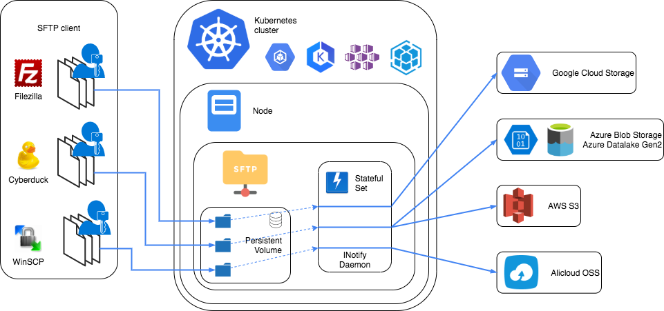

# nautilus-sftp-gateway

## Architecture

This is a Docker image containing a SSH server and an INotify daemon allowing to create a SFTP gateway server. Once deployed, you can connect to the SFTP server and read/write files that are immediately synchronised to GCS or other cloud storage services.

The repository contains the appropriate files to deploy the container to Kubernetes.

## Maintainer

- Cédric Magnan (@Cedric-Magnan or cedric.magnan@artefact.com)

## Overview

When you run a container based on this image, it creates a SFTP server that can only be accessed by specified users, and moves uploaded data to one or more specified buckets.

The users and the buckets are provided at runtime via container Environment variables. When the container starts, it uses the Environment variables to generate the appropriate configuration files and start the services. The container does not persist any data.

The container does not contain any credentials, they must be provided at deployment time via a mounted secrets volume on Kubernetes, or a mounted volume for vanilla Docker. See below for more information.

## Table of contents

- [0 - Installation](./docs/0 - Installation.md)
- [1 - Environment configuration](./docs/1 - Environment configuration.md)
- [2 - Keys Generation](./docs/2 - Keys Generation.md)
- [3 - Cloud configuration](./docs/3 - Cloud configuration.md)
- [4 - Docker configuration](./docs/4 - Docker configuration.md)
- [5 - Cluster configuration](./docs/5 - Cluster configuration.md)
- [6 - SFTP connection](./docs/6 - SFTP connection.md)

## Tutorial

TODO: add video tutorial

